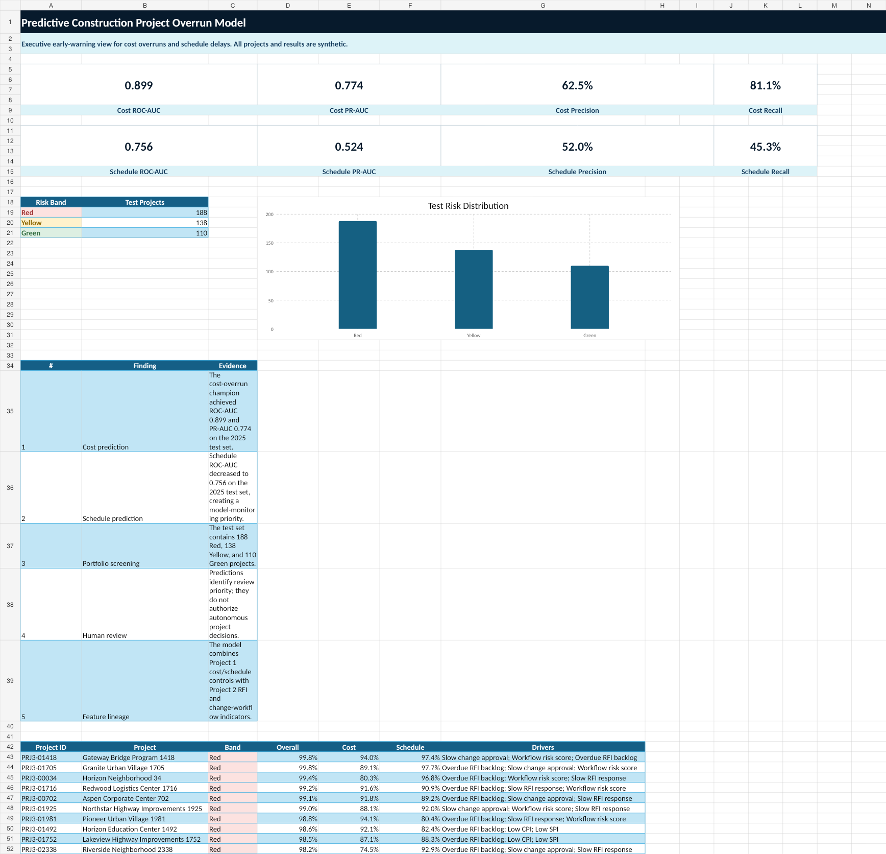

# Predictive Construction Project Overrun Model

## Early-Warning Classification and Regression for Cost Overruns and Schedule Delays



> **Synthetic-data disclosure:** All project names, organizations, budgets, schedules, RFIs, change conditions, workflow records, and outcomes in this repository are synthetic. The dataset was created for portfolio demonstration, education, and analytical-method development. It does **not** represent actual In Project LLC clients or confidential construction records.

## Project Summary

This repository contains an end-to-end construction machine-learning case study that predicts:

- **final cost overrun of at least 10%**; and
- **final schedule delay of at least 30 days**

from early and mid-project controls and workflow indicators.

The project follows the six-phase analytics lifecycle—**Ask, Prepare, Process, Analyze, Share, and Act**—with terminology aligned to CRISP-DM, DMAIC, Microsoft’s data-science lifecycle, and PMI governance concepts.

## Business Question

**Which early and mid-project indicators best predict material construction cost overruns and schedule delays, and how can management prioritize intervention before the outcomes become unavoidable?**

## Validated Portfolio Results

| Metric | Result |
|---|---:|
| Intended synthetic projects | 2,400 |
| Clean modeling projects | 2,362 |
| Predictors | 40 |
| Train projects (2019–2023) | 1,577 |
| Validation projects (2024) | 349 |
| Test projects (2025) | 436 |
| Cost-overrun champion | Random Forest |
| Cost ROC-AUC | 0.899 |
| Cost PR-AUC | 0.774 |
| Schedule-delay champion | Logistic Regression |
| Schedule ROC-AUC | 0.756 |
| Schedule PR-AUC | 0.524 |
| Test risk bands | 188 Red / 138 Yellow / 110 Green |

## Key Findings

- **Cost risk generalized strongly.** The cost-overrun classifier achieved **ROC-AUC 0.899** and **PR-AUC 0.774** on the future 2025 synthetic test period.
- **Schedule prediction worked, but degraded over time.** The schedule-delay classifier achieved **ROC-AUC 0.756** and **PR-AUC 0.524** on the test set, below its stronger validation performance.
- **Temporal degradation was documented rather than hidden.** The schedule model’s future-test decline is treated as a model-monitoring concern and part of responsible analytics practice.
- **Feature lineage came from two earlier case studies.** Project 1 contributed cost/schedule control concepts such as CPI, SPI, variance, and contingency; Project 2 contributed workflow indicators such as RFI backlog, change exposure, approval cycles, and revision loops.
- **Predictions were translated into management review priorities.** Each test project received cost probability, schedule probability, combined probability, and a **Red / Yellow / Green** risk band.
- **Production use is not authorized.** The Act phase defines a governed pilot path, human review, drift monitoring, overrides, retraining triggers, and incident controls.

These results are from a synthetic portfolio. They do not establish causation or represent industry benchmarks.

## Methodology

| Phase | Work completed |
|---|---|
| Ask | Defined the problem, stakeholders, targets, thresholds, scope, and success criteria. |
| Prepare | Designed a new independent synthetic relational dataset for predictive modeling. |
| Process | Removed duplicates, standardized categories, repaired target flags, quarantined invalid records, enforced one-to-one relationships, and loaded SQLite outputs. |
| Analyze | Trained classification and regression models with a time-based train/validation/test split, calibration, feature importance, and segment review. |
| Share | Produced executive dashboards, risk dashboards, feature-driver dashboards, and Power BI/Tableau build specifications. |
| Act | Created a controlled-pilot roadmap, governance framework, human review workflow, monitoring thresholds, override log, RACI, and risk register. |

## Repository Structure

```text
predictive-construction-project-overrun-model-public/
├── README.md
├── START_HERE.md
├── reports/
├── dashboards/
├── assets/
├── data/
├── analysis/
├── automation/
├── documentation/
├── portfolio/
└── sql/
```

## Open These First

- [`reports/Predictive_Construction_Project_Overrun_Model_Case_Study.pdf`](reports/Predictive_Construction_Project_Overrun_Model_Case_Study.pdf)
- [`dashboards/predictive_overrun_share_dashboard.xlsx`](dashboards/predictive_overrun_share_dashboard.xlsx)
- [`dashboards/predictive_overrun_model_analysis.xlsx`](dashboards/predictive_overrun_model_analysis.xlsx)
- [`dashboards/predictive_overrun_model_act_plan.xlsx`](dashboards/predictive_overrun_model_act_plan.xlsx)

## Technical Stack

- **Python**
- **SQL / SQLite**
- **Excel**
- **Power BI specification**
- **Tableau specification**
- **Logistic Regression**
- **Random Forest**
- **Model governance and responsible AI controls**

## Reproduce the Project

Install dependencies:

```bash
pip install -r requirements.txt
```

Run the full local pipeline manually:

```bash
python data/generation/generate_synthetic_overrun_data.py
python data/processing/process_clean_and_validate.py
python analysis/run_modeling.py
python automation/score_new_projects.py analysis/scoring/sample_new_projects.csv automation/output/sample_scored_projects.csv
```

Or use the Windows helper:

```powershell
.\run_project_pipeline.ps1
```

## Important Notes

- All data is synthetic.
- Final outcome fields are excluded from predictors.
- The model is intended for **human decision support**, not autonomous decision-making.
- The monitoring demonstration currently triggers a **Review Required** status because schedule-probability drift exceeded the proposed Yellow threshold.
- This repository is a portfolio case study and **not** a real client deployment.

## Author

**Narciso M. Dickson**  
PMP® · Construction Project Management · Data Analytics · In Project LLC
